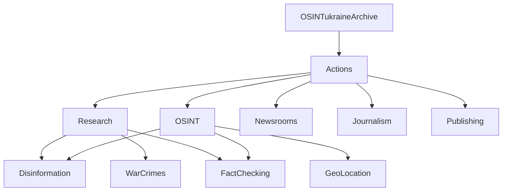
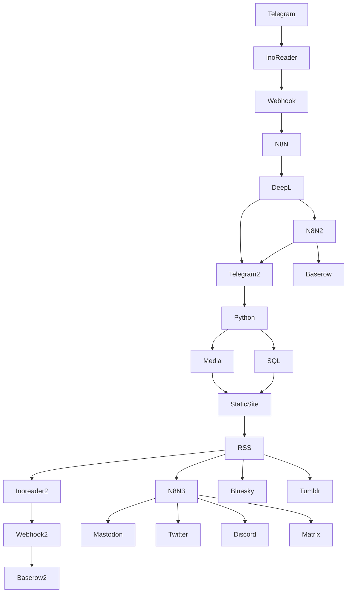

# Tabs {.tabset}
## Visual Schema 

{.align-center}

## Objectives

```mermaid
  graph TD;
      OSINTukraineArchive-->Actions;
      Actions-->Research;
      Research-->Disinformation;
      Research-->WarCrimes;
      Research-->FactChecking;
      Actions-->OSINT;
      OSINT-->GeoLocation;
      OSINT-->FactChecking;
      OSINT-->Disinformation;
      Actions-->Newsrooms;
      Actions-->Journalism;
      Actions-->Publishing;
      
      
```

## Diagram flow

```mermaid
  graph TD;
      Telegram-->InoReader;
      InoReader-->Webhook;
      Webhook-->N8N;
      N8N-->DeepL;
      DeepL-->Telegram2;
      DeepL-->N8N2
      N8N2-->Baserow;
      N8N2-->Telegram2;
      Telegram2-->Python;
      Python-->SQL;
      Python-->Media;
      Media-->StaticSite;
      SQL-->StaticSite;
      StaticSite-->RSS;
      RSS-->Inoreader2;
      Inoreader2-->Webhook2;
      Webhook2-->Baserow2;
      RSS-->N8N3;
      N8N3-->Mastodon;
      N8N3-->Twitter;
      N8N3-->Discord;
      N8N3-->Matrix;
      RSS-->Bluesky;
      RSS-->Tumblr;
      
  
``` 

